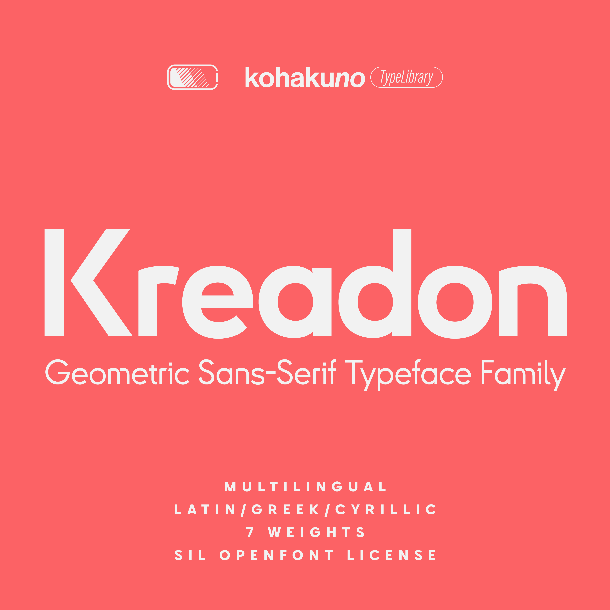

# Kreadon

[![][Fontbakery]](https://Kohakuno-Layer.github.io/Kreadon/fontbakery/fontbakery-report.html)
[![][Universal]](https://Kohakuno-Layer.github.io/Kreadon/fontbakery/fontbakery-report.html)
[![][GF Profile]](https://Kohakuno-Layer.github.io/Kreadon/fontbakery/fontbakery-report.html)
[![][Outline Correctness]](https://Kohakuno-Layer.github.io/Kreadon/fontbakery/fontbakery-report.html)
[![][Shaping]](https://Kohakuno-Layer.github.io/Kreadon/fontbakery/fontbakery-report.html)

[Fontbakery]: https://img.shields.io/endpoint?url=https%3A%2F%2Fraw.githubusercontent.com%2FKohakuno-Layer%2FKreadon%2Fgh-pages%2Fbadges%2Foverall.json
[GF Profile]: https://img.shields.io/endpoint?url=https%3A%2F%2Fraw.githubusercontent.com%2FKohakuno-Layer%2FKreadon%2Fgh-pages%2Fbadges%2FGoogleFonts.json
[Outline Correctness]: https://img.shields.io/endpoint?url=https%3A%2F%2Fraw.githubusercontent.com%2FKohakuno-Layer%2FKreadon%2Fgh-pages%2Fbadges%2FOutlineCorrectnessChecks.json
[Shaping]: https://img.shields.io/endpoint?url=https%3A%2F%2Fraw.githubusercontent.com%2FKohakuno-Layer%2FKreadon%2Fgh-pages%2Fbadges%2FShapingChecks.json
[Universal]: https://img.shields.io/endpoint?url=https%3A%2F%2Fraw.githubusercontent.com%2FKohakuno-Layer%2FKreadon%2Fgh-pages%2Fbadges%2FUniversal.json

Check [Releases](https://github.com/Kohakuno-Layer/Kreadon/releases) to download the font family.

Introducing Kreadon, a font family of geometric sans-serif typefaces. Kreadon offers a simple and graphically appealing typographic style in seven weights, ranging from ExtraLight to ExtraBold, perfect for both headlines and main-body texting. Moreover, it possesses the capability of swappable alternative characters thanks to Opentype features, which contributes to its adaptability. 

Kreadon was initially designed for the branding of StudioGnu, the creators’ community based on the Vocaloid culture, but it is available to the public to inspire and explore further creativity inside and outside the community.
You can find a detailed description of the typographic effects of each OpenType feature below:

* `OpenType Feature ss01`: Alternative Lowercase ‘a’. The default ‘a’ glyph design is a single story, but you can swap a two-story ‘a’ with the OpenType feature. This design variation also applies to other ‘a’ like characters such as ‘a’ with acute, ‘ae’, or Cyrillic ‘a’.
* `OpenType Feature ss02`: Alternative Uppercases and Lowercases. Let me explain what is this feature; for example, default Kreadon’s Uppercase ‘R’ is written down in one stroke, and default lowercase ‘m’ is completely separated into two parts. The design identity is suitable for impactful typography, but it can be slightly bothersome when used in the main body. The ss02 option presents a simpler type design and easily legible characters. This feature applies some glyphs, for example, Uppercase ‘K’, ‘P’, ‘Q’, ‘R’, Lowercase ‘h’, ‘k’, ‘m’, ’n’, ‘r’, and ‘u’. In addition, it also applies some Cyrillic and Greek alphabets.
* `OpenType Feature ss03`: Alternative Uppercase ‘I’ and ‘J’. By enabling this option, alternative character designs with serifs will be activated.
* `OpenType Feature ss04`: Alternative Lowercase ‘i’ and ‘j’. By enabling this option, alternative character designs without serifs will be activated.

Additionally, Kreadon provides some advanced features for your typography:

* Extended Character Sets: Kreadon offers an extensive selection of character sets in the Latin, Greek, and Cyrillic alphabets. This broad range of characters allows for the typing of languages like Turkish or Vietnamese, which may not be possible with other fonts.
* Cyrillic Localization: Just like with Latin alphabets, the range of Cyrillic alphabets varies for each language. Kreadon is designed to accommodate a diverse range of characters. In Bulgarian, certain glyphs appear distinct from those used in other languages, hence Kreadon provides language-specific variations.
* Numerics Variation: Kreadon has a variety of numeric glyphs to enhance the flexibility of your typography. For example, Kreadon has old-style numerics, full-width numerics, and circled numerics.

## Designer

**Kohakuno**, an amateur typographer based on Tokyo, Japan.
* [Twitter/Japanese](https://twitter.com/Amber_layer01)
* [Behance/English](https://www.behance.net/kohakuno)

## Building

Fonts are built automatically by GitHub Actions. 

## Changelog

**9 July 2023. Version 1.10**
- Add some glyphs such as eng.
- Modify file data to solve errors.

**7 July 2023. version 1.00**
- Add Kreadon.

## License

This Font Software is licensed under the SIL Open Font License, Version 1.1.
This license is available with a FAQ at
https://scripts.sil.org/OFL

## Repository Layout

This font repository structure is inspired by [Unified Font Repository v0.3](https://github.com/unified-font-repository/Unified-Font-Repository), modified for the Google Fonts workflow.
