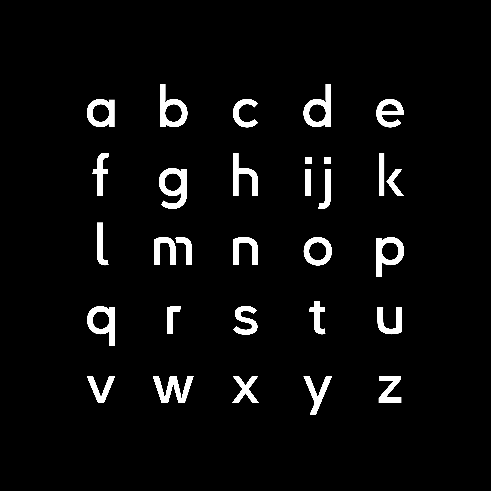
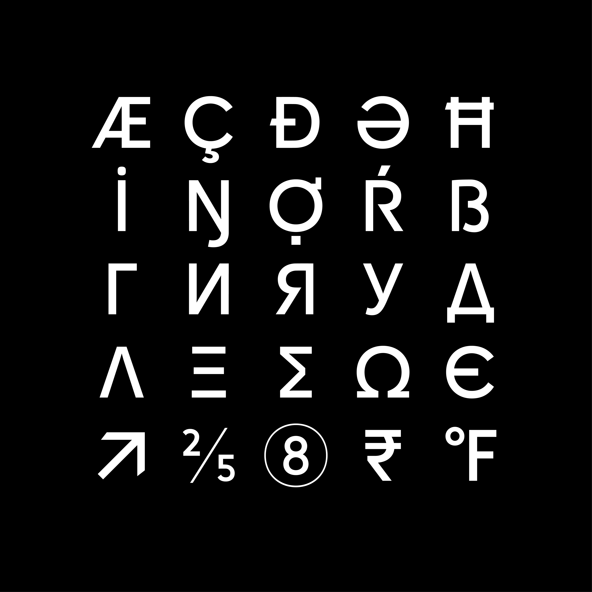

# Kreadon

## Download Kreadon from [here](https://github.com/Kohakuno-Layer/Kreadon/releases)

# OpenType Features

* `OpenType Feature ss01`: Alternative Lowercase ‘a’. The default ‘a’ glyph design is a single story, but you can swap a two-story ‘a’ with the OpenType feature. This design variation also applies to other ‘a’ like characters such as ‘a’ with acute, or Cyrillic ‘a’.
* `OpenType Feature ss02`: Alternative Uppercases and Lowercases. Let me explain what is this feature; for example, default Kreadon’s Uppercase ‘R’ is written down in one stroke, and default lowercase ‘m’ is completely separated into two parts. The design identity is suitable for impactful typography, but it can be slightly bothersome when used in the main body. The ss02 option presents a simpler type design and easily legible characters. This feature applies some glyphs, for example, Uppercase ‘K’, ‘P’, ‘Q’, ‘R’, Lowercase ‘h’, ‘k’, ‘m’, ’n’, ‘r’, and ‘u’. In addition, it also applies some Cyrillic and Greek alphabets.
* `OpenType Feature ss03`: Alternative Uppercase ‘I’ and ‘J’. By enabling this option, alternative character designs with serifs will be activated.
* `OpenType Feature ss04`: Alternative Lowercase ‘i’ and ‘j’. By enabling this option, alternative character designs with serifs will be activated.

## Latin Uppercase Sample

You can switch glyph design with OpenType features. 

## Latin Lowercase Sample

You can switch glyph design with OpenType features. 

## Other Letters Sample

